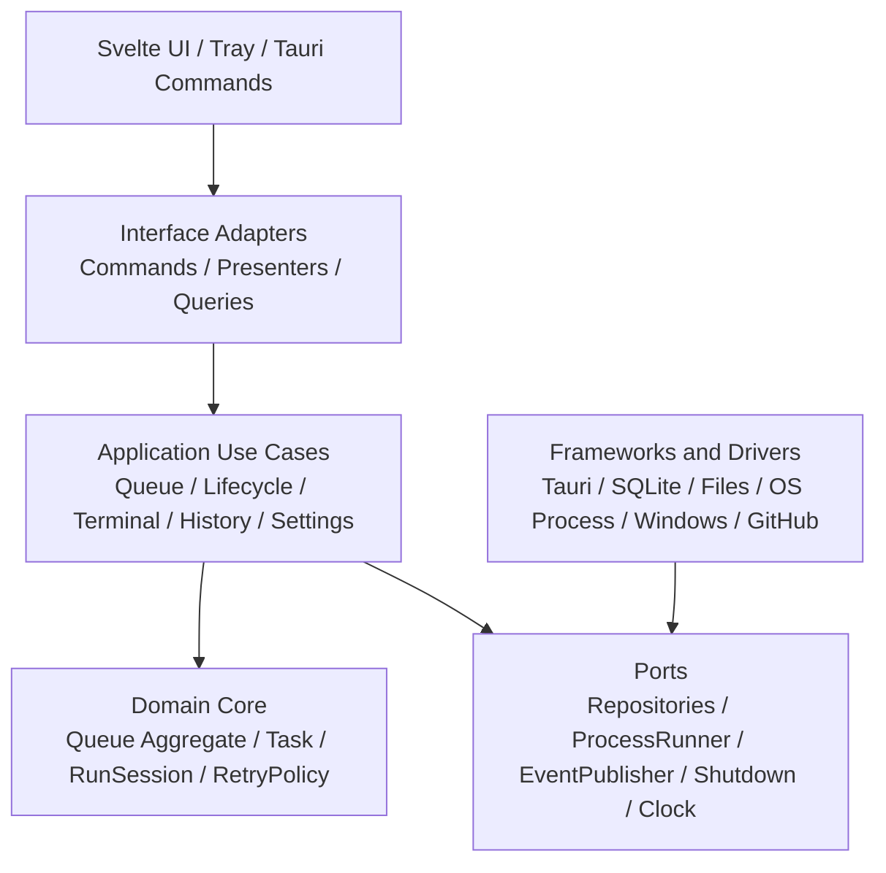

# Clean Architecture Target

This document is the north star for future architecture work. When the user says
"继续", continue moving the codebase toward this target unless a newer document
explicitly supersedes it.

## Final Principle

Tauri is a detail. Svelte is a detail. JSON, SQLite, chunk files, Windows
shutdown, GitHub Actions, and the external CLI process are details.

The core of this product is the download queue state machine and its recoverable
use cases. State transitions, persistence transactions, frontend event
publication, and external side effects must be separated by explicit
boundaries.

The ideal architecture follows the dependency rule: source dependencies point
inward. Domain and application code must not depend on Tauri, Svelte, filesystem
layout, child-process APIs, OS shutdown commands, or GitHub workflow APIs.

## Target Shape



## Layer Responsibilities

### Domain Core

The domain core contains business concepts and rules only.

- `Task`
- `QueueAggregate`
- `RunSession`
- `RetryPolicy`
- `TerminalTranscript`
- `HistoryRecord`
- `ArtifactPackage`

The domain core must not import Tauri, tokio process APIs, serde persistence
schemas, filesystem paths, UI event names, or OS-specific shutdown behavior.

### Application Use Cases

Use cases express system behavior in user and runtime terms.

- `AddTask`
- `StartQueue`
- `PauseQueue`
- `RetryTask`
- `ReorderTasks`
- `RecordTaskCompleted`
- `RecordTaskFailed`
- `AppendTerminalOutput`
- `FlushPendingHistory`
- `PrepareExit`
- `CancelAutoShutdown`
- `SyncPackageArtifacts`

Use cases coordinate domain decisions, repositories, and ports. They may depend
on port traits, but not on concrete infrastructure.

### Ports

Ports describe external capabilities needed by the application.

- `QueueRepository`
- `HistoryRepository`
- `TerminalOutputRepository`
- `SettingsRepository`
- `TaskProcessRunner`
- `FrontendEventPublisher`
- `ShutdownScheduler`
- `ArtifactStore`
- `WorkflowRunGateway`
- `Clock`

Ports are owned by the application layer. Infrastructure implements them.

### Infrastructure Adapters

Adapters are replaceable details.

- Tauri command adapter
- Tauri tray adapter
- Frontend event publisher
- SQLite or file repositories
- Chunked terminal output storage
- OS child-process runner
- Windows shutdown scheduler
- GitHub Actions gateway
- Artifact replacement transaction adapter

Adapters can know about frameworks, file formats, paths, process handles, and
platform quirks. They must not contain queue policy.

## Ideal Runtime Model

The queue should eventually be modeled as an explicit aggregate and state
machine:

```text
Command
  -> QueueApplicationService
  -> QueueAggregate.decide(command)
  -> DomainEvents / StateChanges
  -> UnitOfWork.commit(state, outbox)
  -> SideEffectWorkers consume outbox
```

Starting a CLI process is not the state transition itself. The state transition
produces a durable side-effect request such as:

```text
StartTaskRequested(task_id, command_line, process_token)
```

The process supervisor consumes that request, starts the child process, and
later reports internal facts:

```text
ChildStarted(task_id, process_token)
ChildExited(task_id, process_token, exit_status)
ChildOutputReceived(task_id, stream, bytes)
```

Renderer-originated events must never be authoritative lifecycle facts.

## Transaction Boundary

The ideal design uses a single recoverable transaction boundary for queue state,
history records, terminal metadata, and frontend outbox events.

The long-term preferred storage model is SQLite with WAL:

- `tasks`
- `history_tasks`
- `terminal_chunks`
- `terminal_lines` or chunk blob metadata
- `run_sessions`
- `settings`
- `outbox_events`

Chunk files may still be used for very large terminal payloads, but their index
and recovery state should be transactionally represented.

The target invariant:

```text
No terminal task can disappear.
No completed or failed task can be half-finalized.
No frontend event can be published unless the state it describes is durable.
No side effect can become unrecoverable without an outbox record.
```

## Frontend Target

The frontend is a read-model client.

- Svelte components render state; they do not own queue policy.
- Runtime event names are centralized.
- Queue, history, terminal, settings, and notices are separate stores.
- Terminal live output is keyed by task id, not a global object that invalidates
  unrelated consumers.
- CLI console owns its query model: initial page, earlier pages, live tail,
  active line, and render window.
- `App.svelte` composes views; it should not become a data reconciliation layer.

The frontend may request use cases. It must not decide completion, failure,
retry, or scheduling behavior.

## Package Sync Target

Release and package synchronization should be its own bounded context:

```text
PackageSyncUseCase
  -> WorkflowRunGateway
  -> ArtifactDownloader
  -> ArtifactValidator
  -> ArtifactReplacementTransaction
  -> ReleaseReporter
```

Ideal invariants:

- A supplied run id must match expected workflow, ref, and commit sha.
- Artifacts must carry or imply a validated manifest.
- Local replacement must be transactional: staging, backup, swap, verify,
  rollback, report.
- Backup lifetime is controlled by the replacement transaction, never by an
  unconditional `finally` cleanup.

## Target Directory Shape

```text
src-tauri/src/
  domain/
    task.rs
    queue.rs
    run_session.rs
    retry_policy.rs
    terminal.rs
    artifact.rs

  application/
    queue_use_cases.rs
    task_lifecycle_use_cases.rs
    terminal_output_use_cases.rs
    history_use_cases.rs
    settings_use_cases.rs
    exit_use_cases.rs
    package_sync_use_cases.rs

  ports/
    repositories.rs
    process_runner.rs
    event_publisher.rs
    shutdown.rs
    clock.rs
    artifact_gateway.rs

  adapters/
    tauri_commands.rs
    tauri_tray.rs
    tauri_event_publisher.rs
    sqlite_repositories.rs
    chunked_terminal_store.rs
    os_process_runner.rs
    windows_shutdown.rs
    github_actions_gateway.rs

  composition/
    app_bootstrap.rs
    dependency_graph.rs
```

The exact file names can evolve, but the dependency direction should not.

## Continue Protocol

When the user says "继续":

1. Inspect the current real code and git status first.
2. Pick the nearest architecture move toward this document.
3. Prefer behavior-preserving refactors unless a correctness gap blocks the
   target.
4. Keep changes small, testable, and independently committable.
5. Add architecture guard tests when a boundary is created.
6. Run the relevant frontend/Rust tests before claiming completion.
7. Commit focused batches with clear messages unless the user asks not to.

Short-term convenience should not redefine the target. If a step is too large,
split the step; do not weaken the boundary.
